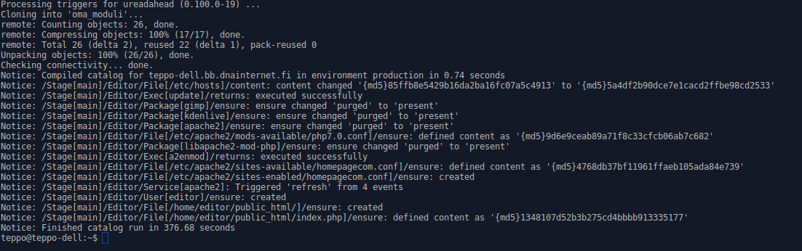

# Oma moduli: "Editor"

Tämä moduli on tehty Haaga-Helian palvelinten hallinta (ict4tn022-2) -kurssin lopuksi.

Moduli tekee seuraavaa:
- hakee päivitykset,
- asentaa apachen,
- tekee virtual hostin 'homepage.com',
- sallii apachessa kotihakemiston ja php:n
- luo käyttäjän editor
- tekee käyttäjälle editor 'public_html' -hakemiston
- laatii em. kansioon aloitussivun index.php
- käyttäjällä editor on oikeus muokata em. tiedostoa
- asentaa kuvankäsittelyohjelman Gimp ja
- videoeditointiohjelman Kdenliven

Moduli löytyy osoitteesta https://github.com/teppoviljanen/oma_moduli

Toteutin harjoituksen Sony Vaio VPCEA2S1E -kannettavalla, jossa Intel Core i3, 4 Gt RAM ja asennettu käyttöjärjestelmä Xubuntu 16.04.1 LTS "Xenial Xerus" - Release amd64.

Määritin lisenssiksi GNU General Public License v3.0.

Aluksi loin GitHubissa julkisen repositoryn oma_moduli. Kloonasin sen gitillä kotihakemistooni

	$ git clone https://github.com/teppoviljanen/oma_moduli.git

Loin modulin editor

	$ cd /etc/puppet/modules
	$ sudo mkdir editor
	$ cd editor
	$ sudo mkdir manifests

Manifests hakemistoon loin tiedostoston init.pp

	$ sudoedit init.pp

### init.pp:n sisältö on seuraava:

class editor{

        exec { 'update':
                command => 'sudo apt-get update',
                path => '/bin:/usr/bin:/sbin:/usr/sbin:',
	}

	package {'apache2':
		ensure => 'installed',
		require => Exec['update'],
	}

	file {'/etc/apache2/sites-available/homepagecom.conf':
		content => template('editor/homepagecom.conf.erb'),
		require => Package['apache2'],
	}

	file {'/etc/hosts':
		content => template('editor/hosts.erb'),
	}

	package { 'libapache2-mod-php':
		ensure => 'installed',
		require => Package['apache2'],
		notify => Service['apache2'],	
	}	

	file { '/etc/apache2/mods-available/php7.0.conf':
		content => template('editor/php7.0.conf.erb'),
		require => Package['apache2'],
		notify => Service['apache2'],
	}

	exec { 'a2enmod':
		command => 'sudo a2enmod userdir',
		path => '/bin:/usr/bin:/sbin:/usr/sbin:',
		require => Package['apache2'],
		notify => Service['apache2'],
	}


	file { '/etc/apache2/sites-enabled/homepagecom.conf':
		ensure => link,
		target => '/etc/apache2/sites-available/homepagecom.conf',
		require => Package['apache2'],
		notify => Service['apache2'],	
	}

	service {'apache2':
		ensure => true,
		enable => true,
		require => Package['apache2'],
	}

	user { 'editor':
		ensure => 'present',		
		password => 'jAwQ639FgEpas',
		managehome => true,
		home => '/home/editor',
	}


	file { '/home/editor/public_html/':
		ensure => 'directory',
		owner => 'editor',
		require => User['editor'],
	}

	file { '/home/editor/public_html/index.php':
		content => template('editor/index.php.erb'),
		owner => 'editor',
		require => File['/home/editor/public_html/'],
	}

        package { 'gimp':
                ensure => 'installed',
		require => Exec['update'],
	}

	package { 'kdenlive':
		ensure => 'installed',
		require => Exec['update'],
	}

}


Tämän jälkeen loin hakemiston templates polkuun /etc/puppet/modules/editor

Loin seuraavat templatet:

### homepagecom.conf.erb, jonka sisältö:

```
<VirtualHost *:80>

	ServerName homepage.com
	ServerAlias www.homepage.com

	DocumentRoot /home/editor/public_html/

		<Directory /home/editor/public_html/>
			Require all granted
		</Directory>

</VirtualHost>
```

### hosts.erb. jonka sisältö:

```
	127.0.0.1	localhost
	127.0.1.1	orja
	127.0.0.1	homepage.com

	# The following lines are desirable for IPv6 capable hosts
	::1     ip6-localhost ip6-loopback
	fe00::0 ip6-localnet
	ff00::0 ip6-mcastprefix
	ff02::1 ip6-allnodes
	ff02::2 ip6-allrouters
```

### index.php.erb, jonka sisältö:

```
	<!DOCTYPE html>

	<html>
		<body>
			<?php
				echo "Welcome Editors homepage!";
			?>
		</body>
	</html>
```

### php7.0.conf.erb, jonka sisältö:

```
<FilesMatch ".+\.ph(p[3457]?|t|tml)$">
    SetHandler application/x-httpd-php
</FilesMatch>
<FilesMatch ".+\.phps$">
    SetHandler application/x-httpd-php-source
    # Deny access to raw php sources by default
    # To re-enable it's recommended to enable access to the files
    # only in specific virtual host or directory
    Require all denied
</FilesMatch>
# Deny access to files without filename (e.g. '.php')
<FilesMatch "^\.ph(p[3457]?|t|tml|ps)$">
    Require all denied
</FilesMatch>

# Running PHP scripts in user directories is disabled by default
#
# To re-enable PHP in user directories comment the following lines
# (from <IfModule ...> to </IfModule>.) Do NOT set it to On as it
# prevents .htaccess files from disabling it.
#<IfModule mod_userdir.c>
#    <Directory /home/*/public_html>
#        php_admin_flag engine Off
#   </Directory>
#</IfModule>
```

Loin kotihakemistooni polun /home/teppo/oma_moduli/puppet/modules/

Kopion sinne luomani modulin editor

Tämän jälkeen loin hakemistoon /home/teppo/oma_moduli scriptin start.sh, jonka sisältö:

sudo apt-get update
sudo apt-get -y install git puppet
git clone https://github.com/teppoviljanen/oma_moduli.git
cd oma_moduli
sudo puppet apply --modulepath puppet/modules/ -e 'class {editor:}'


Ajoin scriptin

	$ bash start.sh

Scripti toimi ja moduli asentui onnistuneesti.

Tämän jälkeen asensin Xubuntu 16.04.1 LTS "Xenial Xerus" - Release amd64 -käyttöjärjestelmän kannettavaan tietokoneeseen Dell Latitude E6420, jossa Intel Core i5 ja 4 Gt RAM.

Latasin scriptin GitHubista

	$ wget https://raw.githubusercontent.com/teppoviljanen/oma_moduli/master/start.sh

Ajoin scriptin

	$ bash start.sh

Scripti toimi ja moduli asentui onnistuneesti.





## Lähteet:

Omat aiemmin laatimani harjoitustehtävät, jotka löytyvät osoitteista:

https://teppoviljanen.wordpress.com/palvelinten-hallinta-tehtava-1/

https://github.com/teppoviljanen/h2

https://github.com/teppoviljanen/h3 ja

https://github.com/teppoviljanen/h4

Puppet Cookbook, joka löytyy osoitteesta:

https://www.puppetcookbook.com/

